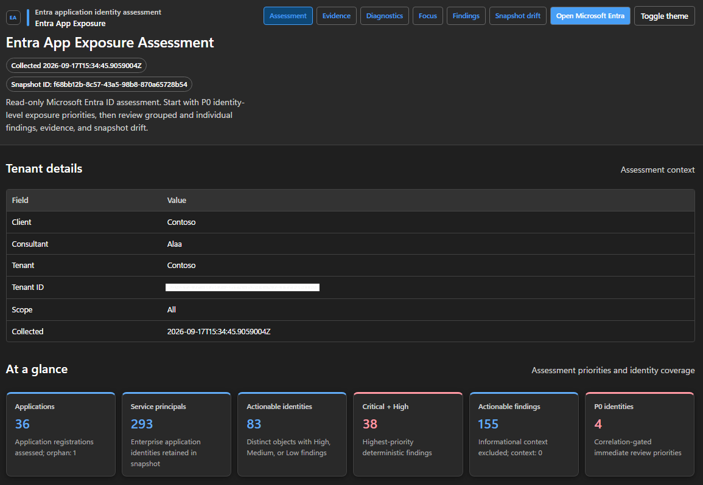
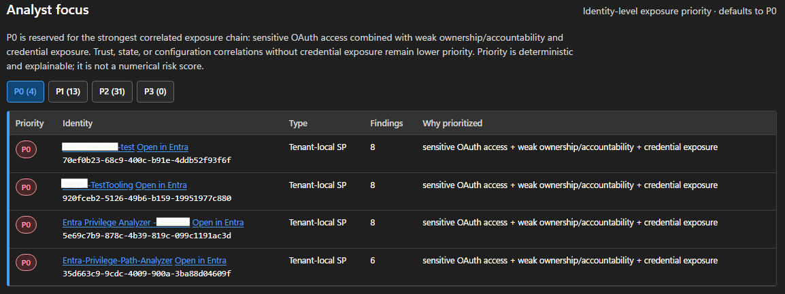
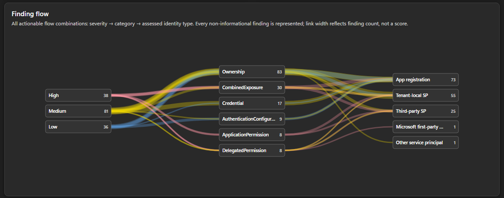
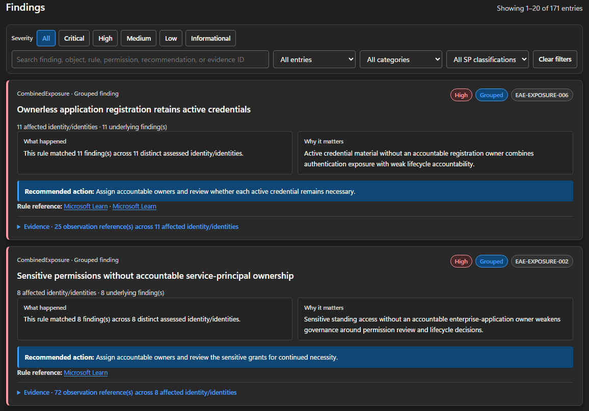

<div align="center">

# Entra App Exposure

**Evidence-driven application identity exposure assessment for Microsoft Entra ID**

[](#)
[](#requirements)
[](LICENSE)

Entra App Exposure collects Microsoft Entra application identity state into a portable snapshot, evaluates deterministic exposure rules offline, prioritizes high-impact identity combinations, and produces evidence-linked self-contained reports.

**Collect once. Assess offline. Prioritize exposure. Trace every finding to evidence.**

[Quick start](#quick-start) · [What it is](#what-it-is) · [Capabilities](#capabilities) · [Permissions](#permissions) · [Usage](#usage) · [Security model](#security-model)

</div>

---

## Table of contents

- [What it is](#what-it-is)
- [Screenshots](#screenshots)
- [Capabilities](#capabilities)
- [Requirements](#requirements)
- [Permissions](#permissions)
- [Quick start](#quick-start)
  - [1. Install](#1-install)
  - [2. Configure authentication](#2-configure-authentication)
  - [3. Run an assessment](#3-run-an-assessment)
- [Usage](#usage)
  - [Live tenant assessment](#live-tenant-assessment)
  - [Activity context](#activity-context)
  - [Exclude Microsoft first-party findings](#exclude-microsoft-first-party-findings)
  - [Offline assessment](#offline-assessment)
  - [Compare against a baseline](#compare-against-a-baseline)
  - [Target a single application identity](#target-a-single-application-identity)
- [Assessment model](#assessment-model)
- [Interactive report](#interactive-report)
- [Output](#output)
- [Security model](#security-model)
- [Architecture](#architecture)
- [Cloud support and limitations](#cloud-support-and-limitations)
- [Validation](#validation)
- [Repository structure](#repository-structure)
- [Contributing & security reporting](#contributing--security-reporting)
- [License](#license)

---

## What it is

Entra App Exposure is a **read-only Microsoft Entra application identity exposure assessment engine** built with PowerShell and Microsoft Graph.

It focuses on the security state surrounding **application registrations, enterprise applications/service principals, OAuth consent, credentials, ownership, authentication configuration, and workload activity**. Collection happens once; snapshot validation, rule evaluation, prioritization, drift analysis, and reporting operate on the frozen evidence package.

### Collect → Assess → Prioritize

| Capability | What it provides |
|---|---|
| Collect | Tenant-wide application registrations, service principals, OAuth grants, ownership, credentials, application configuration, and optional activity context |
| Assess | Versioned deterministic rules backed by explicit evidence rather than opaque scoring |
| Correlate | Cross-signal exposure such as sensitive OAuth access combined with weak accountability and credential risk |
| Prioritize | Identity-level P0–P3 analyst priorities, with P0 reserved for the strongest exposure correlations |
| Explain | Findings with what happened, why it matters, affected identities, evidence, references, and recommended action |
| Re-analyze | Portable offline assessment with zero Microsoft Graph calls after snapshot collection |
| Compare | Semantic snapshot drift for application-identity exposure changes over time |
| Report | Self-contained HTML assessment, evidence, and diagnostics views plus JSON/CSV artifacts |

> **Not a general Entra posture scanner, topology engine, or attack-path tool.** Entra App Exposure intentionally stays focused on application identity and OAuth exposure. It does not assess Conditional Access, broad identity governance, attack paths, tenant-wide consent workflow administration, or numerical tenant risk scores.

The tool is strictly **read-only** and does not remediate tenant configuration.

## Screenshots

The following views are recommended for the public README once release screenshots are captured from a sanitized test tenant:

<details>
<summary><b>CLI Invoke run</b></summary>


</details>

<details>
<summary><b>Main assessment overview</b></summary>



</details>

<details>
<summary><b>Analyst Focus — P0 priorities</b></summary>



</details>

<details>
<summary><b>Finding Flow</b></summary>



</details>

<details>
<summary><b>Findings overview</b></summary>



</details>


## Capabilities

Entra App Exposure currently assesses:

- application registrations and service principals/enterprise applications;
- tenant-owned, third-party, Microsoft first-party, and managed-identity service-principal classification;
- application permissions (`appRoleAssignments`) and delegated OAuth consent grants;
- resource-qualified sensitive-permission exposure;
- application-registration and service-principal ownership/accountability;
- certificate and client-secret metadata, including expiration and lifetime conditions;
- supported account type (`signInAudience`);
- web, SPA, and public-client redirect URI configuration;
- fallback public-client and implicit token issuance settings;
- exposed API scopes and pre-authorized client applications as assessment evidence;
- application roles, identifier URIs, and optional-claims context;
- optional recent service-principal activity context;
- verified-publisher/trust context where relevant to application exposure;
- deterministic individual and grouped findings;
- identity-level P0–P3 exposure prioritization;
- portable snapshots, offline re-analysis, and semantic drift comparison;
- evidence-linked HTML, JSON, and CSV reporting;
- optional exclusion of Microsoft first-party enterprise applications from finding evaluation while preserving them in the snapshot.

The bundled baseline is intentionally application-exposure-specific. Tenant-wide user-consent policy, admin-consent request/reviewer workflow, Conditional Access, directory-role/PIM posture, attack paths, and remediation automation remain out of scope.

## Requirements

- PowerShell 7.6 or later
- A dedicated Microsoft Entra application registration for app-only assessment
- For **live assessments only**:
  - `Microsoft.PowerShell.SecretManagement` 1.1.2 or later
  - `Microsoft.PowerShell.SecretStore` 1.0.6 or later

The module itself and offline snapshot-analysis path do not require authentication modules.

For development/release validation:

- Pester 6.1.0
- PSScriptAnalyzer 1.25.0

Validate the local environment:

```powershell
.\Scripts\Test-EntraAppExposureRequirements.ps1
```

## Permissions

Use only the Microsoft Graph **application permissions** required by the assessment mode you intend to run.

| Capability | Microsoft Graph application permission |
|---|---|
| Core application identity, service-principal, ownership, permission, and delegated OAuth grant evidence | `Directory.Read.All` |
| Service-principal activity context *(optional)* | `AuditLog.Read.All` |

`Directory.Read.All` is used as the core read permission because the assessment includes tenant-wide delegated OAuth grant collection in addition to application/service-principal evidence. `AuditLog.Read.All` is requested only when activity collection is enabled.

Grant admin consent to the dedicated assessment application. Normal operation performs read-only Microsoft Graph requests.

## Quick start

### 1. Install

```powershell
git clone https://github.com/0xDarknightHacks/EntraAppExposure.git
cd .\EntraAppExposure

Install-Module Microsoft.PowerShell.SecretManagement -RequiredVersion 1.1.2 -Scope CurrentUser
Install-Module Microsoft.PowerShell.SecretStore -RequiredVersion 1.0.6 -Scope CurrentUser

Import-Module .\EntraAppExposure.psd1 -Force
```

Validate prerequisites:

```powershell
.\Scripts\Test-EntraAppExposureRequirements.ps1
```

### 2. Configure authentication

Create the local non-secret configuration file:

```powershell
$configDirectory = Join-Path $HOME '.entra-app-exposure'
New-Item -ItemType Directory -Path $configDirectory -Force | Out-Null

@{
    TenantId = '<tenant-id>'
    ClientId = '<application-client-id>'
} | ConvertTo-Json | Set-Content (Join-Path $configDirectory 'config.json') -Encoding utf8
```

Register SecretStore and save the assessment application's **client-secret value**:

```powershell
Register-SecretVault `
    -Name AppExposureVault `
    -ModuleName Microsoft.PowerShell.SecretStore

$secret = Read-Host 'Assessment app client secret' -AsSecureString
Set-Secret `
    -Name AppExposureGraphClientSecret `
    -Vault AppExposureVault `
    -Secret $secret
Remove-Variable secret
```

> ⚠️ **Never commit** tenant identifiers, secrets, snapshots, reports, diagnostics, tokens, private keys, or exported assessment data.

### 3. Run an assessment

```powershell
$run = Invoke-EntraAppExposure `
    -Scope All `
    -ClientName '<client>' `
    -ConsultantName '<analyst>'
```

The command authenticates, collects the application-identity evidence, freezes a portable snapshot, evaluates the rule baseline offline, generates findings and priorities, and writes the report package.

## Usage

### Live tenant assessment

```powershell
$run = Invoke-EntraAppExposure `
    -Scope All `
    -ClientName '<client>' `
    -ConsultantName '<analyst>'
```

### Activity context

```powershell
$run = Invoke-EntraAppExposure `
    -Scope All `
    -IncludeActivity `
    -ActivityLookbackDays 90 `
    -ClientName '<client>'
```

Activity enrichment prefers the Microsoft Graph service-principal sign-in activity report and retains the filtered sign-in-log path as a compatibility fallback. This optional mode requires `AuditLog.Read.All`.

### Exclude Microsoft first-party findings

```powershell
$run = Invoke-EntraAppExposure `
    -Scope All `
    -ExcludeMicrosoftFirstParty `
    -ClientName '<client>'
```

The exclusion applies to finding evaluation and analyst triage. Microsoft first-party service principals remain in `snapshot.json`, preserving complete evidence and reproducibility.

### Offline assessment

```powershell
$run = Invoke-EntraAppExposure `
    -OfflineSnapshotPath .\snapshot.json `
    -ClientName '<client>'
```

Offline analysis performs **zero Microsoft Graph requests**.

### Compare against a baseline

```powershell
$run = Invoke-EntraAppExposure `
    -Scope All `
    -BaselineSnapshotPath .\baseline\snapshot.json `
    -ClientName '<client>'
```

### Target a single application identity

Use `-Scope Single` with `-TargetAppId` or `-TargetDisplayName` to inspect one service principal by object ID, application/client ID, or unambiguous display name.

```powershell
$run = Invoke-EntraAppExposure `
    -Scope Single `
    -TargetAppId '<object-or-app-id>' `
    -ClientName '<client>'
```

For the complete supported parameter surface:

```powershell
Get-Help Invoke-EntraAppExposure -Full
```

## Assessment model

The bundled baseline is stored in `Rules/Baseline.json` and validated by `Schemas/RulePack.schema.json`. Rule metadata is external to the PowerShell evaluator implementation.

Rule IDs follow:

```text
EAE-<SURFACE>-<CATEGORY>-<NNN>
```

Examples include `EAE-OAUTH-APP-001`, `EAE-SP-OWNER-001`, `EAE-APP-CRED-003`, and `EAE-SP-ACTIVITY-001`.

Each rule carries its severity, title, rationale, recommendation, applicable object type, required evidence surfaces, and references. Findings remain deterministic and evidence-linked. Grouped findings are emitted only when a rule produces multiple concrete findings; the individual findings remain available for object-level investigation.

P0–P3 is a separate **identity-level analyst priority**, not a numerical risk score and not a replacement for finding severity. P0 is reserved for the strongest multi-signal exposure correlations, such as sensitive OAuth access combined with weak accountability and credential exposure.

## Interactive report

The generated HTML report is self-contained and designed for offline analyst/identity-engineer review. It includes:

- tenant and assessment overview;
- **Analyst Focus** with deterministic identity-level P0–P3 priorities;
- an actionable finding-flow Sankey showing **all** severity → category → assessed-identity-type combinations;
- one unified Findings workspace for grouped and individual findings;
- severity, entry-type, category, and service-principal-classification filters;
- consistent finding cards with what happened, why it matters, recommended action, references, and evidence;
- affected-identity context for grouped findings;
- direct Microsoft Entra administrative navigation where supported;
- evidence and diagnostics views for collection/runtime provenance.

Informational activity context is excluded from the actionable Sankey but remains available in the assessment evidence.

## Output

Each run produces a timestamped assessment package. Key artifacts include:

- `snapshot.json` — portable canonical assessment evidence;
- `findings.json` / `findings.csv` — concrete deterministic findings;
- `finding-groups.json` — machine-readable grouped triage view;
- `run-summary.json` — assessment/runtime summary;
- `artifact-manifest.json` — artifact integrity hashes;
- `report.html` — analyst-facing assessment report;
- `evidence.html` — evidence-oriented view;
- `diagnostics.html` — collection/runtime diagnostics.

Generated output can contain sensitive tenant metadata and is intentionally excluded from source control/release packages.

## Security model

Entra App Exposure is designed around five boundaries:

1. **Read-only Graph access** — normal collection uses read permissions and read-only requests.
2. **Dedicated app-only identity** — assessment authentication is separated from an administrator's interactive identity.
3. **Secret isolation** — tenant/client identifiers are stored separately from the client secret, which is retrieved through PowerShell SecretManagement.
4. **Snapshot boundary** — after collection, rule evaluation, prioritization, drift, export, and reporting operate offline. `GraphCallsAfterSnapshot = 0` is treated as a release boundary.
5. **Sensitive local artifacts** — generated tenant evidence remains local and must not be committed or published.

See [SECURITY.md](SECURITY.md) for vulnerability reporting and operational security guidance.

## Architecture

The repository intentionally keeps the runtime compact. Graph transport is confined to `Private/Graph.ps1`, authentication to `Private/Auth.ps1`, collection to `Private/Collection.ps1`, and downstream assessment processing to snapshot, rule, drift, reporting, and pipeline layers.

```text
app-only authentication
        ↓
read-only Graph collection
        ↓
portable snapshot.json
        ↓
deterministic rule evaluation
        ↓
identity-level prioritization
        ↓
optional offline drift
        ↓
self-contained reports
```

The portable snapshot is the trust boundary between tenant collection and assessment intelligence. This keeps findings reproducible and allows offline re-analysis without Graph access.

## Cloud support and limitations

Version 1.0.0 targets the **Microsoft Commercial cloud**. Authentication authority and Microsoft Graph endpoints currently use the global commercial-cloud endpoints.

Optional service-principal activity enrichment relies on a Microsoft Graph **beta/preview** API when available, with a filtered sign-in-log compatibility path. Sovereign clouds, including US Government, US Department of Defense, and Microsoft Cloud China, are not supported by the v1.0.0 runtime.

The assessment reports observed application identity exposure from available Microsoft Graph evidence. It does not determine business necessity, prove exploitability, or declare an application over-privileged without an external expected-access/business baseline.

Entra App Exposure is an **independent community project**. It is not affiliated with, endorsed by, sponsored by, or an official product of Microsoft Corporation. Microsoft, Microsoft Entra, and Microsoft Graph are trademarks of the Microsoft group of companies.

## Validation

Run the complete Pester suite:

```powershell
Invoke-Pester -Path .\Tests -Output Detailed
```

Validate release hygiene before publishing:

```powershell
$r = .\Scripts\Test-EntraAppExposureRelease.ps1
$r.ReleaseEligible
```

The release gate checks repository/runtime integrity and rejects generated tenant artifacts, secrets/keys, archives, stale transitional naming, invalid rule IDs, and source files that violate the Graph transport boundary.

The v1.0.0 release candidate was additionally validated through successful tenant-wide live assessment runs with deterministic finding output, artifact-manifest verification, zero observed throttling/retry failures in the validated runs, and `GraphCallsAfterSnapshot = 0`.

## Repository structure

```text
EntraAppExposure/
├── EntraAppExposure.psd1
├── EntraAppExposure.psm1
├── Public/
├── Private/
├── Rules/
├── Schemas/
├── Scripts/
├── Tests/
├── README.md
├── SECURITY.md
├── CONTRIBUTING.md
├── CHANGELOG.md
└── LICENSE
```

## Contributing & security reporting

- Development guidance: [CONTRIBUTING.md](CONTRIBUTING.md)
- Security reporting: [SECURITY.md](SECURITY.md)

Contributions should preserve the project's application-exposure scope, read-only Microsoft Graph boundary, deterministic snapshot behavior, evidence provenance, and offline-processing contract.

## License

Entra App Exposure is released under the [Apache License 2.0](LICENSE).
